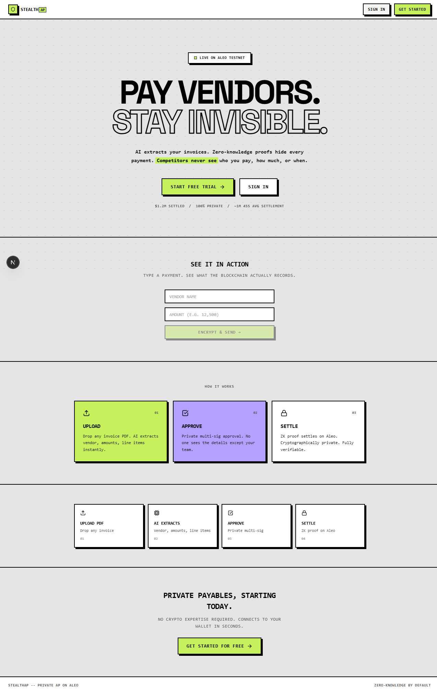
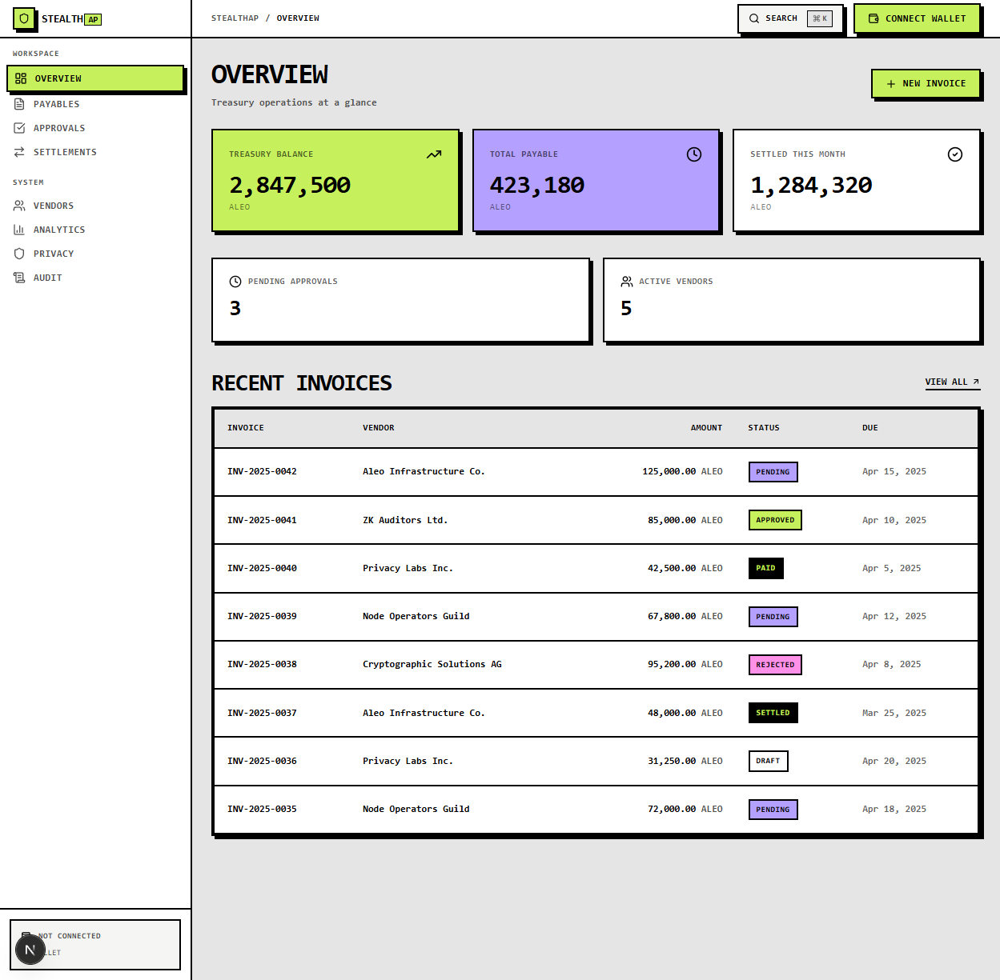
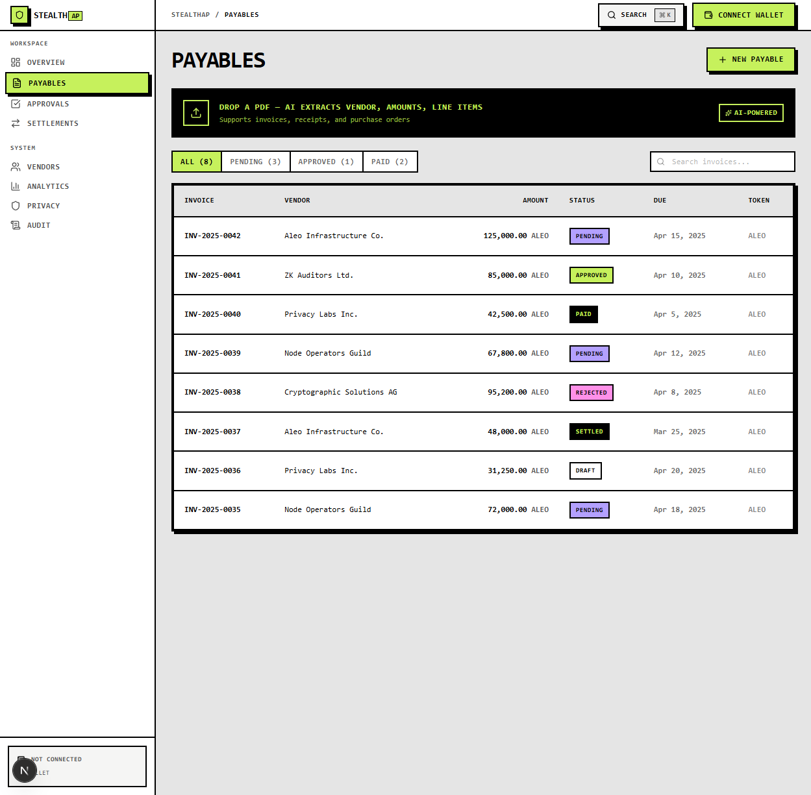
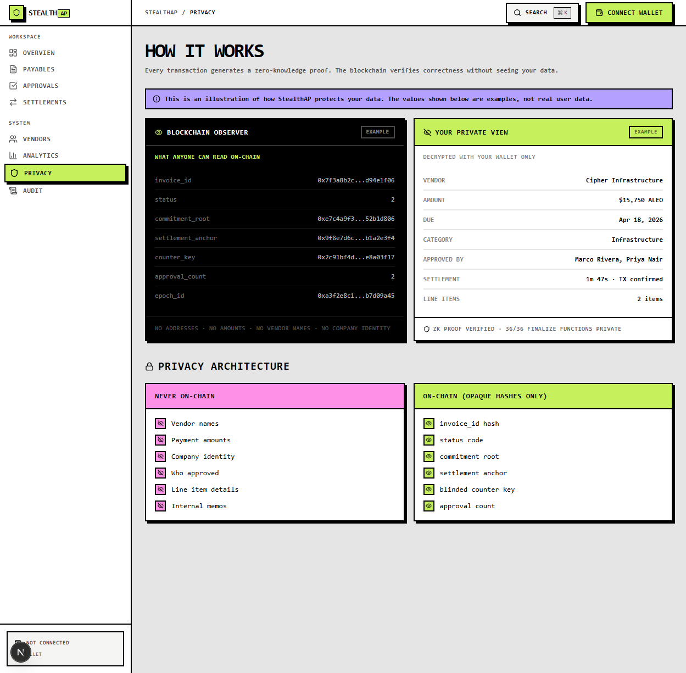

# STEALTHAP

**AI-Powered Private Treasury Operations on Aleo.**

> Upload invoice → AI reads it → Team approves privately → Payment settles in ZK → Nobody sees who you paid, how much, or why.

---

## SCREENSHOTS

### Landing Page


### Dashboard


### Payables — Invoice Management


### Privacy — What the Chain Sees vs What You See


---

## WHAT IS THIS

StealthAP is accounts payable for crypto-native companies. Built on Aleo. Every payment is private by default.

- **For finance teams** — the people who process, approve, and settle vendor payments
- **Not a payment gateway** — not for merchants receiving money
- **Not an invoicing tool** — not for vendors sending bills
- **Think Bill.com / Ramp** — but competitors can't spy on your spending

---

## THE PRIVACY MODEL

| Data | On-Chain (Public) | In Records (Private) |
|------|-------------------|---------------------|
| Invoice | `invoice_id` hash only | Amount, vendor, items, tax, dates |
| Payment | `settlement_anchor` hash only | Amount, payer, payee, token |
| Approval | `approval_count` only | Who approved, approval order |
| Vendor identity | Never | Name, contact, terms |
| Company identity | Blinded counter key | Real identity |
| Escrow amount | Never | Locked amount, deadline |

**No address, no amount, no vendor name EVER appears in finalize.**

---

## DEPLOYED CONTRACTS (TESTNET v2)

All 5 programs are live on Aleo testnet (v2). `@noupgrade` — immutable. [Verify on explorer →](https://explorer.provable.com/programs)

| Program | Transitions | What It Does |
|---------|-------------|-------------|
| `stealthap_inv_v2.aleo` | 19 | Dual records, Merkle vendor allowlist, pseudonymous keys, duplicate detection |
| `stealthap_pay_v2.aleo` | 13 | ALEO/USDCx/USAD private payments, escrow, scheduled payments, join/split |
| `stealthap_wf_v2.aleo` | 14 | Private multi-sig approvals, spending limits, delegation, threshold routing |
| `stealthap_aud_v2.aleo` | 11 | Selective disclosure, compliance proofs, ZK credit scoring |
| `stealthap_bat_v2.aleo` | 7 | Commit-reveal epoch settlement, atomic batch execution |
| **Total** | **64** | **2,955 lines of Leo** |

### Dependency Graph

```
stealthap_inv_v2.aleo  ←── stealthap_pay_v2.aleo (verifies before pay)
       ↑               ←── stealthap_wf_v2.aleo (verifies before approve)
       ↑               ←── stealthap_aud_v2.aleo (reads commitment for proofs)
       
credits.aleo + test_usdcx_stablecoin.aleo + test_usad_stablecoin.aleo
       
stealthap_bat_v2.aleo (commit-reveal epoch settlement, credits.aleo only)
```

---

## FEATURES

- **AI Invoice Extraction** — Drop a PDF. AI extracts vendor, amounts, line items with confidence scores. NVIDIA NIM primary, Gemini fallback.
- **Private Multi-Sig Approvals** — Chain sees "3 approved" but NOT who approved.
- **Commit-Reveal Batch Settlement** — Batch N payments into epochs. Settle atomically. Observer can't correlate timing.
- **Vendor Merkle Allowlist** — Prove vendor authorization without revealing the vendor list.
- **Pseudonymous Counterparty Keys** — Different identity per invoice. Unlinkable.
- **On-Chain Spending Limits** — Budget enforcement in finalize. Category-level caps.
- **Scheduled Payments** — Pay at a specific block height.
- **Escrow** — Lock funds. Release on delivery. Timeout refund. 3-way arbiter.
- **Selective Disclosure Audit** — Reveal only specific fields to auditors. Time-limited access.
- **ZK Credit Scoring** — Prove payment reputation without revealing payment history.
- **Triple Token** — ALEO + USDCx + USAD with private CPI transfers.

---

## TECH STACK

| Layer | Tech |
|-------|------|
| Frontend | Next.js 16, React 19, Tailwind CSS 4, Framer Motion, Zustand |
| Backend | Supabase (PostgreSQL + RLS + Realtime), Next.js API Routes |
| AI | NVIDIA NIM (primary) + Google Gemini (fallback) — vision models for invoice extraction |
| Chain | Leo 4.0.0 (5 programs, 64 transitions), Aleo testnet |
| Wallets | Shield, Leo, Puzzle, Fox — via custom adapter |
| Proving | Dual strategy: wallet-based (primary) + Provable DPS (optional) |
| Auth | Supabase magic link + wallet connect |
| Email | Resend for approval notifications |

---

## QUICK START

```bash
git clone <repo-url>
cd stealthap
npm install
cp .env.example .env.local   # fill in your keys
npm run dev                   # http://localhost:3000
```

### Environment Variables

```
NEXT_PUBLIC_SUPABASE_URL=        # Supabase project URL
NEXT_PUBLIC_SUPABASE_ANON_KEY=   # Supabase anon key
SUPABASE_SERVICE_ROLE_KEY=       # Supabase service role key
NVIDIA_NIM_API_KEY=              # NVIDIA NIM (optional if Gemini set)
GEMINI_API_KEY=                  # Google Gemini (optional if NVIDIA set)
RESEND_API_KEY=                  # Resend for emails
```

### Database Setup

Run `supabase/migration.sql` in your Supabase SQL Editor. Creates all 7 tables + RLS policies.

---

## HOW TO TEST

1. Open the app → connect wallet (Shield/Leo/Puzzle/Fox)
2. Go to Payables → click "New Payable" → upload a PDF invoice
3. AI extracts the data → review and save
4. Invoice appears in the ledger as "draft"
5. Approve it on the Approvals page
6. Settle via the Settlements page → "New Payment"
7. Check the Aleo explorer — only hashes visible
8. Visit `/dashboard/privacy` to see what the chain sees vs what you see

---

## LICENSE

MIT
